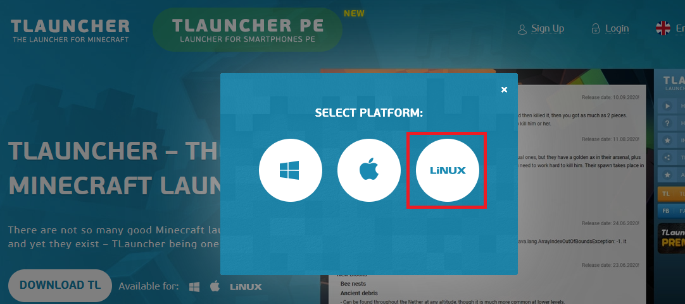

# Build a Minecraft Server

## Table of content here
- [Build a Minecraft Server](#build-a-minecraft-server)
  - [Table of content here](#table-of-content-here)
  - [Project Description](#project-description)
  - [Requirements](#requirements)
  - [Setting Up The Minecraft Server on Local PC (Ubuntu)](#setting-up-the-minecraft-server-on-local-pc-ubuntu)
    - [Local PC specifications](#local-pc-specifications)
    - [Download and install Java Development Kit](#download-and-install-java-development-kit)
    - [Download and install Minecraft](#download-and-install-minecraft)
    - [Download and setup Minecraft server](#download-and-setup-minecraft-server)
      - [Create a Game folder](#create-a-game-folder)
    - [Configure server files](#configure-server-files)
    - [Run the game](#run-the-game)

## Project Description
In this project, I am creating a Minecraft Server hosted on a Local machine. The application must meet the following requirements:
* Must provide a server room to play.
* Able to play with other people over same network.

## Requirements
The project requires the use of a PC. I am using the following specifications:

* OS: Ubuntu 20.04.2 LTS
* RAM: 8 GB
* CPU: Intel i5

## Setting Up The Minecraft Server on Local PC (Ubuntu)
### Local PC specifications

Inorder to run Minecraft's server the local PC must have minimum following specifications:

* RAM: 512mb
* CPU: Intel Pentium 4
* Network download speed: 3 Mbit/s 
* Network upload speed: 2 Mbit/s 
* HDD: 2 GB empty space
(5GB if you are doing frequent backups) 

With this specification, server will be able to handle 1-2 players. As the specifications are upgraded, the server will be able handle more players. 

### Download and install Java Development Kit

The Minecraft version that is used here is developed using Java programming language. So, we have to download [JDK](https://en.wikipedia.org/wiki/Java_Development_Kit) .

Goto [Amazon Coretto 16 JDK](https://docs.aws.amazon.com/corretto/latest/corretto-16-ug/downloads-list.html), download JDK for linux x64 deb package.

After that, the file will begin to download. After the download is complete double click the .deb file.

A window will appear. Click install to install the JDK. After the installation, close the opened window.

The JDK is now installed.

### Download and install Minecraft

1. Goto the [TLauncher](https://www.minecraft.net/en-us/store/minecraft-java-edition)
2. Click on `Download TL`

1. Click on Linux

A file will begin to download. After the download
1. Extract the downloaded zip file

1. Goto the extracted folder from terminal

1. Run the following command to execute the .jar file 
  `sudo java -jar TLauncher-x.xx.jar` Where `x's` are the version of the file you download.

    
    
    A process will begin

    

  * The `sudo` gives admin priviliges, so that we do not encounter any permission denied issue. 
  * The `java` invokes the JDK we installed. 
  * The `-jar` argument here is the type of the file we are adding, to explicitly tell what to compile and Java compiler knows how to handle .jar file. 
  * The `Tlauncher-x.xx.jar` is the file name with extension. 

2. The TLauncher will appear. Set your username, then click on `Install` to begin downloading the game files and install them.

    

    The download will begin.

    

3. After the download is complete, a window will appear. Click on `OK`

9. Now click on `Enter the game` to launch Minecraft.
  
  Minecraft will appear.
  

10. Minimize the window for now, will come back later after we create the server.

### Download and setup Minecraft server

Goto [Minecraft official server download page](https://www.minecraft.net/en-us/download/server/), and download minecraft_server.x.x.x.x.jar file (x can be any number).

A .jar file will be downloaded

#### Create a Game folder

1. Create a new folder on any drive.
2. Like For example ~:Home\Downloads\Server\
3. Copy and paste the downloaded jar, in the created folder.

### Configure server files

1. Open the terminal, and cd to the folder where the download .jar file is.

2. Run this command to execute the .jar file 
`java -Xmx1024M -Xms1024M -jar minecraft_server.x.xx.x.jar nogui ` 
Where `x's` are the file version.

  * `-xmx1024M` and `-xms1024M` is the argument that is given the the .jar file.
  * `minecraft_server.x.xx.x.jar` is the file name
  * `nogui` part is optional, one can leave if he/she want's the the server to run in GUI instead of terminal. I used `no gui` here.  

3. The server will start and you will see this message. 

 The server jar file will automatically create necessary configurations file.

3. Have to make some modifications, before the server is of any use.
4. Open the `eula.txt` file in the directory where the .jar file is.

5. Replace `eula=false` with `eula=true` and save the eula.txt file . The purpose of doing this, is of agreeing with the terms and condition.

6. Open `server.properties` file. 

7. Change `online-mode=true` to `online-mode=false`

6. Relaunch the server jar file again.

7. If `done` appears on terminal, it means the server is successfully created. Keep this terminal opened, as long as the game have to be played.

8. Goto the settings > WiFi > Click on the gear icon of your connected network . Copy the ipv4 address. The ipv4 address is needed so that people with other devices on same network, can find this server over LAN.

### Run the game

1. Open the minimized game and goto the multiplayer tab.

2. Paste the copied ipv4 address and then click on `Join Server`

The Game will appear on a server world!

