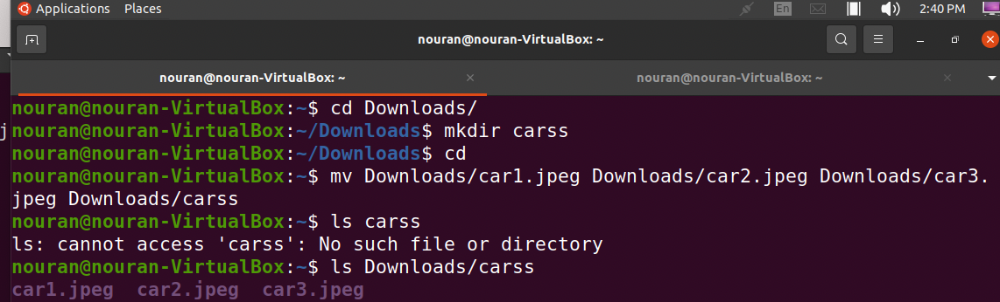

# Question 1: Creating Files and Directories

# Question 2: Removing Files and Directories

../lab4/q2part2.png)

# Question 3: Moving Files and Directories

# Question 4: Copying Files and Directories

