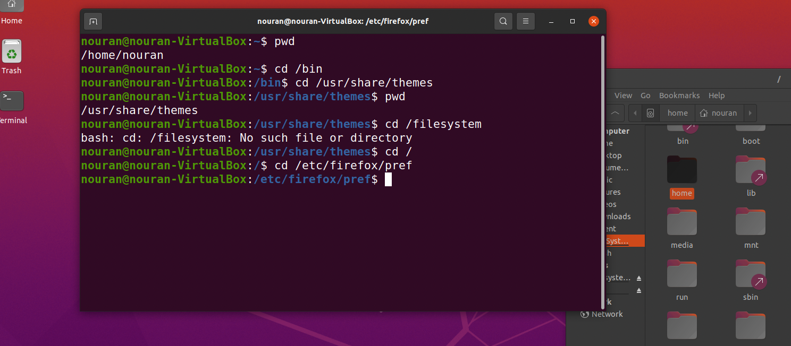
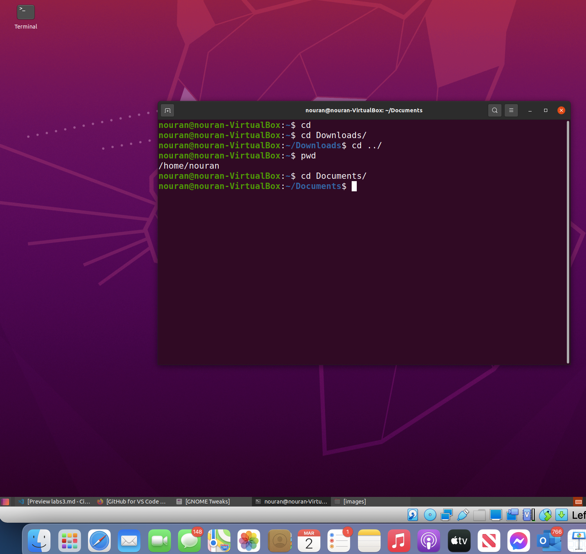
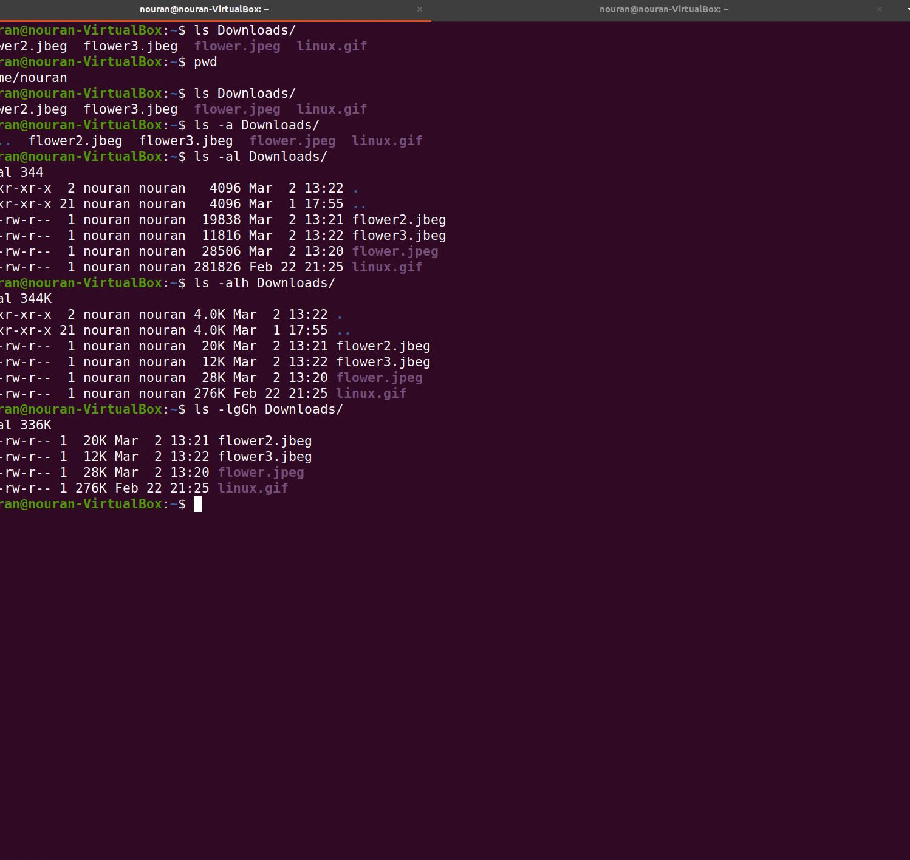
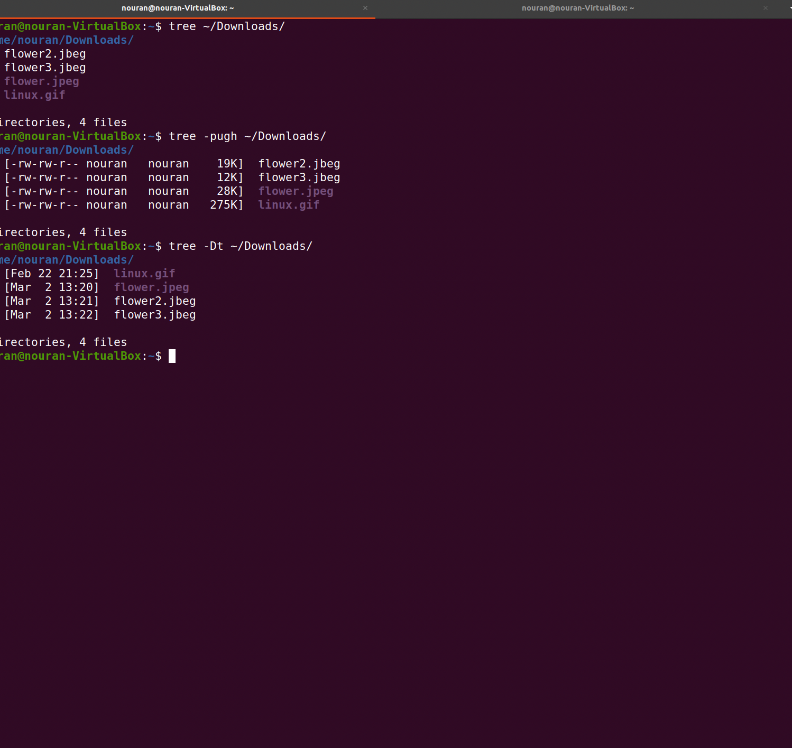
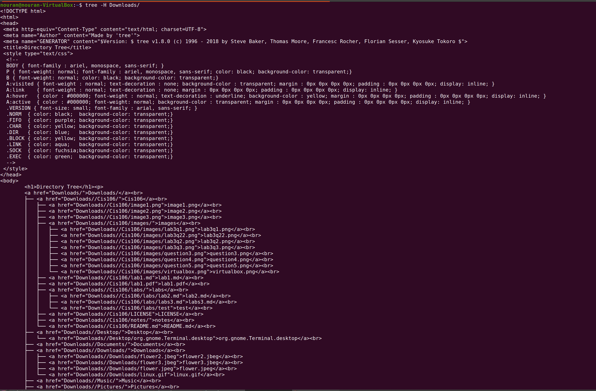
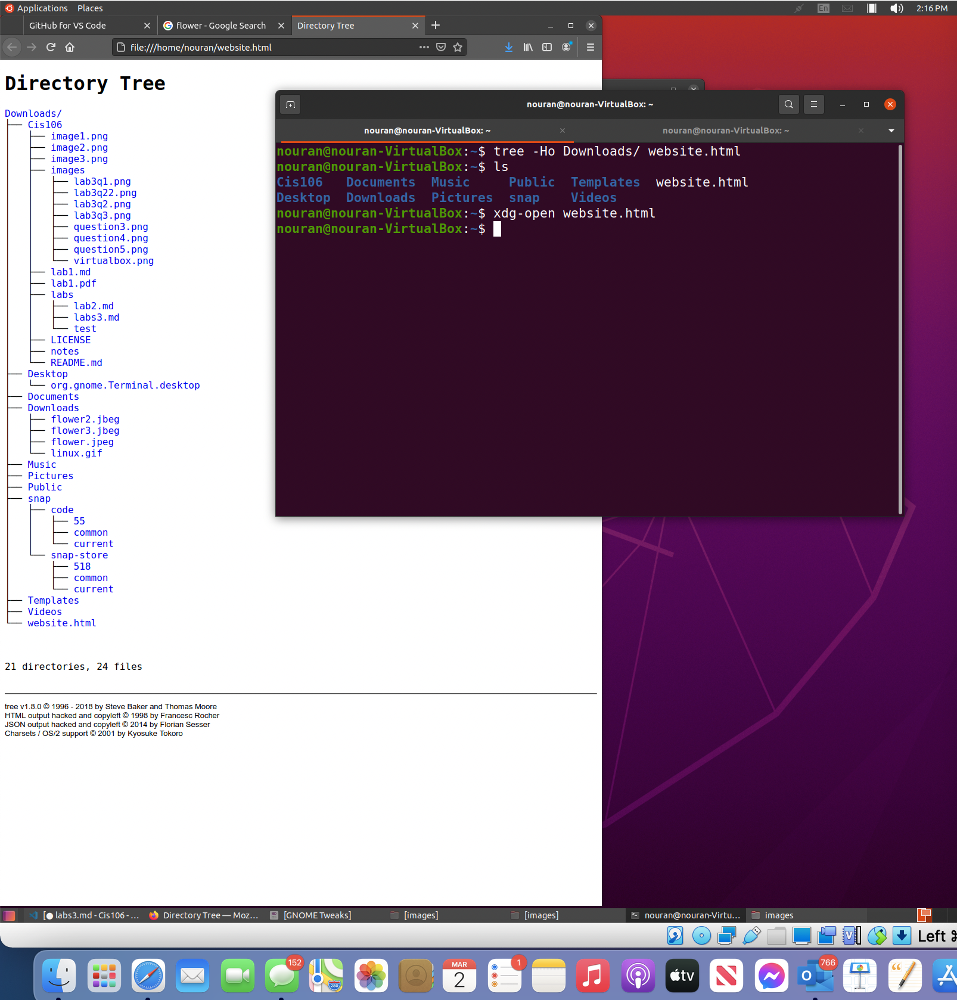
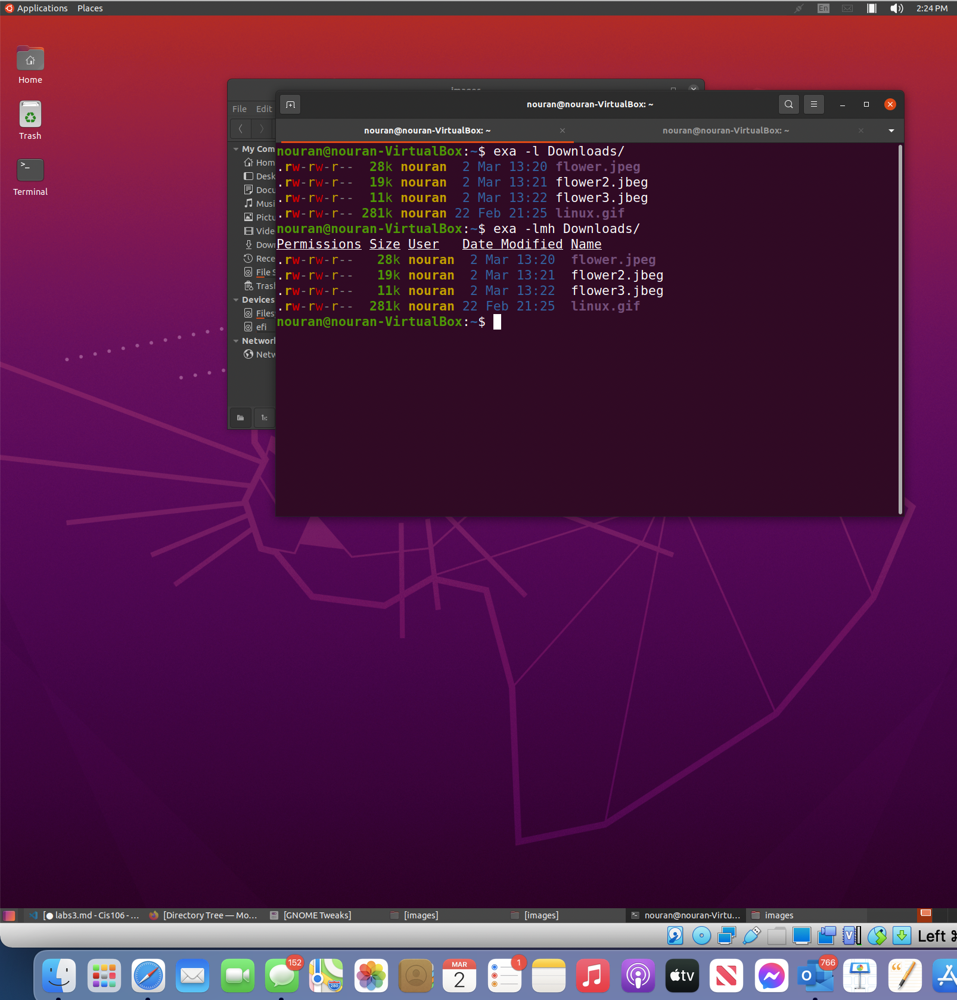

# Lab 3 | Installing software and navigating the file system | Answers
Assignment description [here](https://raw.githubusercontent.com/ra559/cis106/main/labs/lab3.md)

## Question 1
1. Which command did you use to search for the themes and to install them?
to search:apt search theme
to install: sudo apt intsall yoyu-gtk-theme
 
2. Which commands did you use to find and install the web browser? to find:apt search web browser
to install:sudo apt install yorick-doc

3.1 What is the name of the package?yorick-doc

3.2 What dependencies are needed in order to install the package? (you can either take a screenshot of the terminal or copy and paste from the terminal)
3.3 How much disk space will the package utilize after installation? 7,083 kB
 

## Question 2

## Question 3

## Question 4

## Question 5

