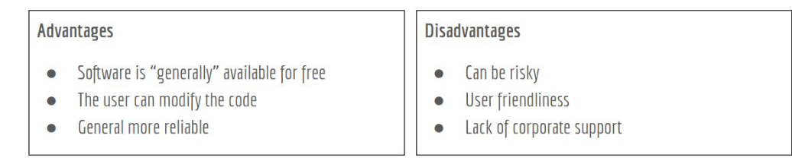

# Notes Lecture 1 What is Linux
### Why Do you need to learn linux?
* Linux runs in a lot of devices. Example: laptops, desktops, servers, smartphones, IoT devices, etc
* Linux powers the cloud
* Linux is used by a lot of companies even Microsoft
### What is Linux?
* Linux is a kernel. A kernel is the core of any operating system.
* An operating system that uses the Linux kernel is called a Linux Distribution. Example: Ubuntu and Android.
* Linux is multitasking, multi-user, and multipurpose OS.
* Linux is a modular operating system.
### Linux distributions

* There are a large number of Linux distributions.
* There are two main Linux Distributions:
  * Debian
  * Redhat
* There are also other independent distributions:
  * Slackware
  * Arch
  * Gentoo
  ### Linux Architecture
  
 * Linux is modular which means that users can remove and add/remove whatever they need or don't need.
   * **Kernel** ​= the core of the operating system. Manages the hardware.
   * **Daemons**​ = background programs that run independent of the user.
   * **Shells**​ = the interface that accepts user input and translates it so that the kernel can use it.
   * **Graphical Desktop Environmen​t** = a collection of software that makes the graphical interface.
* In Linux everything is a file.
* Type of files:
  *  Device files
  * Directory files ○ Binary files
  * Regular files.
### Software licensing agreement
* A license agreement outlines the rights a user has to a given software.
* Types of licensing agreement:
* 
open source | closed source | free software
------------|---------------|--------------
Software can be distributed for free or a fee.The source code must be distributed with the software | Software can be distributed for free or a fee. ​The end user has limited access to the software and the source code is not available.|Software can be distributed for free or a fee. The user has total control of the software and the source code. The software must comply with the 4 freedoms.

##### The 4 freedoms
* Freedom 0: the user can run the program as you wish, for any purpose .
* Freedom 1: the user can study how the program works, and change it.
* Freedom 2: the user can redistribute copies.
* Freedom 3: the user can distribute copies of your modified versions.
**Learn more**: ​ https://www.gnu.org/philosophy/free-sw.en.html

### Advantges/Disadvantges of Open Source software 

### what is Ubuntu?
Ubuntu is a **Linux distribuation** freely availabe with both community and professional suppoort.
* Ubuntu is suitable for both desktop and server use.
* The current Ubuntu release supports:
* Intel x86 (IBM-compatible PC)
* AMD64 (x86-64)
* ARMv7
* ARMv8 (ARM64)
* IBM POWER8/POWER9 (ppc64el)
* IBM Z zEC12/zEC13/z14
* IBM LinuxONE Rockhopper I+II/Emporer I+II (s390x)
### More about Ubuntu:
Ubuntu includes thousands of pieces of software, starting with the Linux kernel version 5.4 and GNOME 3.28, and covering every standard desktop application from word processing and spreadsheet applications to internet access applications, web server software, email software, programming languages and tools and of course several games.
### Some Ubuntu distributions are:
* Linux Mint
* Pop!_OS
* elementary OS
* Zorin OS
* Linux Lite
* Peppermint OS
*  BackBox Linux

  

