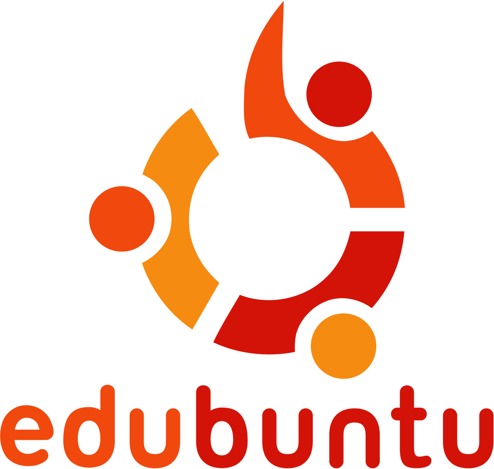

# Homework 3 Finding a Linux Distributions to Solve Specific Problems.
  
## Scenario 1: Using a Live Linux Installation

John is fixing Mario’s laptop. He needs to prepare a live USB flash drive that he can boot Linux from so that he can access some important information. The problem is that he only has a 4GB flash drive available. Which Linux distribution would you advise John to use to prepare the live USB installation?

### Ans:

logo | Based on | URL 
-----|----------|-----
 | Debian | https://ubuntu.com/download/desktop

Ubuntu is based on Debian distro. Ubuntu can be downloaded from the official [Ubuntu webstie](https://ubuntu.com/download/desktop). The supported processor architecture of ubuntu are Intel x86-based (i386), AMD64 & Intel 64 (amd64), ARM with hardware FPU (armfh), 64bit ARM (arm64), IBM POWER Systems (ppc64el), IBM z/Architecture (amd64). In the scenario given, John should download Ubuntu, as it is widely available on many platforms and it has a large community, to which diagnosing and troubleshooting will be easier since answers are available on the internet. Ubuntu desktop (ubuntu-20.04.2.0-desktop-amd64) .iso file takes 2.67 GB, so it can be put into 4GB flash drive.

## Scenario 2: Using Linux for parental control
Mario is concerned about his children using the house computer. He has an older laptop that he has not used in a while and has hired you to prepare that laptop for his children to use. Mario wants the children to use the computer mostly for educational purposes so he asks you to install educational tools in it. He is also concerned about his children using the internet so asks you if you could somehow install a web browser/search engine that has parental control or at least blocks adult content. Mario has given you $150 dollars for upgrades so that if needed you can proceed without contacting him. Which Linux distribution would install in Mario’s older laptop? 

### Ans:

logo | Based on | URL 
-----|----------|-----
 | Debian | https://www.edubuntu.org/download

Edubuntu is designed for use in classrooms inside schools, homes and communities. Edubuntu is based on Debian distro. Edubuntu can be downloaded from the official [Edubuntu webstie](https://www.edubuntu.org/download). The supported processor architecture of ubuntu are Intel x86-based (i386), AMD64 & Intel 64 (amd64), ARM with hardware FPU (armfh), 64bit ARM (arm64), IBM POWER Systems (ppc64el), IBM z/Architecture (amd64). In the scenario given, I will install Edubuntu, as it has all the basic features of a general purpose computing and softwares like browsers, multimedia, office can be installed. It has great community support. Edubuntu comes pre-installed with Gnome Nanny, which is parental control software written for the Gnome Desktop Environment.

    1. Control which websites the user can and cannot access.
    2. At what times of the week and for how long a user can:
        a. Be using the computer.
        b. Browse the web.
        c. Email.
        d. Instant Message.
    3. Control computer usage.
    4. Control web access: filter out the web pages seen by each of the user by blocking undesirable websites.
    5. Easy to understand and configure.

 

## Scenario 3: Linux + Gaming
Johanna is a gamer. She loves playing RPGs and Indie games. Johanna makes a living streaming her gaming sessions on Twitch and YouTube. She is angry because, during one of her live streams, windows 10 decided to install an update. All of Johanna’s games are available for Linux and she is good enough with computers to be able to pick up using a new operating system. Which Linux distribution would you recommend Johanna to try?

### Ans:

logo | Based on | URL 
-----|----------|-----
 | Arch | https://sourceforge.net/projects/mgame/

Manjaro Gaming is based Manjaro Linux which is based on Arch distro. Manjaro Gaming can be downloaded from the official [Sourceforge](https://sourceforge.net/projects/mgame/). The supported processor architecture of Manjaro are x86-64, i686 (unofficial), ARM (unofficial). In the scenario give, Johanna should download Manjaro Gaming, as it is a great choice for content creation as it supports applications like chatting software, streaming apps, devices for taking screenshots, and audacity. Manjaro Gaming sole purpose is gaming, so it has great support for games. Manjaro gaming supports many emulators and also steam.

## Scenario 4: Reviving an old PC
Giorgina has an old computer that came with Windows Vista. She cannot afford to buy a new computer or update her current PC. Her computer is used for online shopping, reading emails, paying her bills, and listening to music. All her music is on an external hard drive and she normally does not keep important information on her computer. Georgina is willing to pay you to make her computer faster. You have concluded that installing Linux is the simplest and most cost-efficient way to help her. However, in such an old PC, Ubuntu 20.04 will be almost as slow as Windows 10 so you need to find another distribution that is much lighter on system resources and has been designed for running on older hardware. Which distribution will you install in Georgina’s ~~dinosaur~~ PC?

### Ans:

logo | Based on | URL 
-----|----------|-----
 | Debian | https://lubuntu.net/downloads/

Lubuntu is a lightweight version of Ubuntu which is based on Debain distro. Lubuntu can be downloaded from the official [Lubuntu webstie](https://lubuntu.net/downloads/). The supported processor architecture of Lubuntu are Intel x86-based (i386), AMD64 & Intel 64 (amd64), ARM with hardware FPU (armfh), 64bit ARM (arm64), IBM POWER Systems (ppc64el), IBM z/Architecture (amd64). In the scenario given, Giorgina should download Lubuntu, first of all as it is widely available on many platforms and it has a large community. Secondly, Lubuntu is llightweight version of ubuntu and it can run on older hardware just fine. The minimum system requirements for Lubuntu 13.04 are a Pentium II or Celeron CPU with PAE support, 128 MB of RAM and at least 2 GB of hard-drive space. Lubuntu comes with all core features of ubuntu and has great software support for everyday use.  
